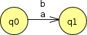
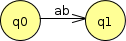

**Due: Monday, Sep 18th** by 11:59 PM

Your Task
=========

Your task is to create finite automata for the regular languages described below.

For each of the following finite automata problems, use JFLAP to construct the automaton, saving it in a JFLAP file (which will have a **.jff** file extension). Please use the filenames **prob1.jff**, **prob2.jff**, etc.

The JFLAP jar file is here:

> [JFLAP.jar](../resources/JFLAP.jar)

You can start it from a terminal window with the command

    java -jar JFLAP.jar

If the problem asks for a deterministic finite automaton, make sure that your automaton does not have any nondeterministic states. (In JFLAP, use the **Test&rarr;Highlight Nondeterminism** menu option.)

**Important**: For all of your finite automata, make sure that each transition is labeled with either a *single* input symbol, or lambda (λ), which is how JFLAP denotes an epsilon transition (a transition that does not consume a symbol from the input string.) JFLAP allows transitions to consume multiple input symbols, but please do not use this feature.

Note that JFLAP will display multiple transitions from one state to another with a single arrow, and will "stack" the accepted input symbols.  This is absolutely fine, since it is actually multiple transitions on various single input symbols, rather than a single transition consuming multiple input symbols.  For example, the following situation is fine:

> 

The following situation is *not* acceptable:

> 

Problem 1
---------

Construct a deterministic finite automaton that recognizes the language over the alphabet {a, b} containing all strings with an odd number of b's.

For example, the following strings are members of the language:

> b
>
> ab
>
> aba
>
> bbabaa

The following strings are not members of the language:

> ε
>
> abb
>
> bababb

Problem 2
---------

Construct a deterministic finite automaton that recognizes the language over the alphabet {a, b} containing all strings with an even number of a's and an odd number of b's.

For example, the following strings should be accepted by the automaton:

> b
>
> aab
>
> aba
>
> baa
>
> bbabaaa

The following strings should be rejected by the automaton:

> ε
>
> ab
>
> aabb
>
> abab

Problem 3
---------

Construct a finite automaton (deterministic or nondeterministic) that recognizes the language over the alphabet {a, b} generated by the regular expression:

> (a\|ab\|abb\|abbb)\*

For example, the following strings should be accepted by the automaton:

> ε
>
> a
>
> aa
>
> aab
>
> abba
>
> abbabbab

The following strings should be rejected by the automaton:

> ba
>
> abbbb

Problem 4
---------

Construct a finite automaton (deterministic or nondeterministic) that recognizes the language over the alphabet {a, b, c} of all strings not containing the substring ba.

For example, the following strings are members of the language:

> ε
>
> a
>
> ab
>
> bb
>
> bc
>
> cbc
>
> abbb

The following strings are not members of the language:

> ba
>
> baba
>
> aba
>
> ccaabac

Problem 5
---------

Construct a deterministic finite automaton that recognizes the language over the alphabet {a, b} of all strings where the number of a's in the string is a multiple of 3.

For example, the following strings should be accepted by the automaton:

> ε
>
> bb
>
> ababa
>
> aaba
>
> aaababaa

The following strings should be rejected by the automaton:

> a
>
> aba
>
> baaabaa

Submitting
==========

Create a zip file that has the JFLAP (.jff) files containing your automata for problems 1-5.

Submit the zip file to Marmoset as **assign02**. The Marmoset URL is

> <https://cs.ycp.edu/marmoset>
