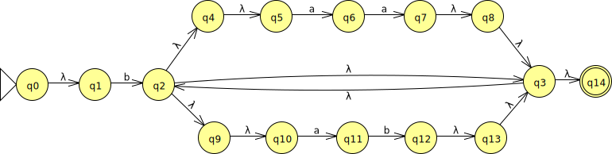

# Getting Started

This is a paper and pencil exercise.

# Your Task

Consider the following NFA (nondeterministic finite automaton):

Convert this NFA to a DFA: a *deterministic* finite automaton.  Simulate the execution of the NFA by considering which *sets* of NFA states map to each DFA state.

As you encounter reachable states, make sure you immediately follow epsilon transitions (denoted above with λ) to find the *epsilon closure* of each reachable set of NFA states.  For example, even though q0 in the NFA is the start state, q1 is reachable from q0 by an epsilon transition, so NFA states {q0, q1} map to the DFA start state.

Your task is to produce:

* The table mapping NFA state sets to corresponding DFA states
* The resulting DFA (equivalent to the NFA)

<!--
## Solution

Here is a solution: [lab03soln.pdf](lab03soln.pdf)
-->
