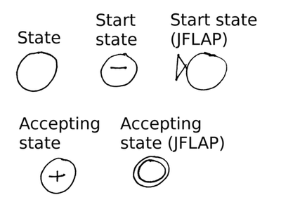
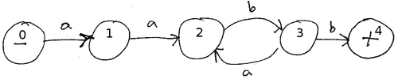

Finite automata
===============

A *finite automaton* is an abstract machine that serves as a recognizer for the strings that comprise a regular language. The idea is that we can feed an input string into a finite automaton, and it will answer "yes" or "no" depending on whether or not the input string belongs to the language that the automaton recognizes.

A finite automaton consists of states and transitions. We denote states as circles and transitions as arrows connecting one state to another.

Exactly one state of a finite automaton is designated as the start state. The start state is often represented by marking it with a minus ("-") symbol. JFLAP denotes the start state by marking it with a triangle. ([JFLAP](http://jflap.org/) is a software package for experimenting with finite automata and other mechanisms for specifying formal languages.)

At least one state of a finite automaton is designated as an accepting state. It is legal for a finite automaton to have multiple accepting states. An accepting state is often represented by marking it with a plus ("+") symbol. JFLAP denotes an accepting state by drawing it with two circles, one inside each other.

To summarize:

> 

Note that it is legal for the start state to also be an accepting state.

A transition from one state to another is labeled with a symbol (from the alphabet of the language recognized by the finite automaton) or with the special symbol epsilon ("&epsilon;").

Algorithm
---------

A finite automaton processes an input string according to the following algorithm.

The input string is read from a **tape**. The **tape head** is initially positioned over the first symbol of the input string. The current state starts out as the start state.

> Loop {
>
> > 1.  If the current state has a transition labeled &epsilon;:
> >
> >     **Nondeterministic choice**: either
> >
> >     -   Choose a transition labeled &epsilon; to the next state (updating current state) and go back to beginning of loop
> >     -   Do nothing (go to step 2)
> >
> > 2.  if there are no more symbols to be read from the tape:
> >
> >     If the current state is an accepting state, then the input string is accepted and the algorithm terminates
> >
> >     If the current state is not an accepting state, then the input string is rejected and the algorithm terminates
> >
> > 3.  If the current state has no transition labeled with a symbol matching the symbol under the tape head:
> >
> >     The input string is rejected and the algorithm terminates
> >
> > 4.  **Nondeterministic choice**:
> >
> >     Choose a transition labeled with a symbol matching the one under the tape head. Move the tape head forward one position. Follow the transition to the next state (updating current state).
> >
> }

Example: for the following finite automaton:

> 

The input string

> aabababb

causes the algorithm to traverse the states

> 0 1 2 3 2 3 2 3 4

Because the input tape is empty when the algorithm reaches state 4 (an accepting state), the string is accepted.

Nondeterminism
--------------

In the algorithm, two points were labeled as "nondeterministic choices".

Nondeterminism means that when the algorithm is faced with multiple choices for what to do next, it does them all "at the same time". One way to think about this is that a parallel universe is created and the algorithm continues in both the current universe and the parallel universe, making a different choice in each universe.

Nondeterminism affects finite automata as follows: an automaton accepts an input string as part of the language recognized by the automaton as long as there is at least one universe in which the automaton accepts the input string. The input string is rejected (not part of the language) if there is no universe in which the string is accepted.

Deterministic vs. Nondeterministic Finite Automata
--------------------------------------------------

Only some finite automata can exhibit nondeterminism. A finite automaton that never exhibits nondeterminism is called a deterministic finite automaton, or DFA. A finite automaton that can exhibit nondeterminism is called a nondeterministic finite automaton, or NFA.

There are two features of finite automata that can lead to nondeterminism:

> transitions labeled &epsilon;
>
> multiple transitions out of a single state having the same label

Therefore, a DFA is simply a finite automaton that does not have either of these features.

Interestingly, DFAs and NFAs have the same amount of expressive power: given any NFA, we can construct a DFA that recognizes precisely the same language as the NFA, and vice versa. However, to construct an equivalent DFA for an NFA may require an exponential increase in the number of states.

Relationship between regular expressions and finite automata
------------------------------------------------------------

Regular expressions and finite automata are *equivalent* ways of specifying a regular language, and algorithms exist to convert from one to the other.

We will cover the algorithm for converting an NFA to a DFA in the next lecture.

Lexical Analysis
================

*Lexical analysis* is the process of reading the source text of a program and converting it into a sequence of tokens.

Since the lexical structure of more or less *every* programming language can be specified by a regular language, a common way to implement a lexical analyzer is to

1.  Specify regular expressions for all of the kinds of tokens in the language. Then, use the alternation operator to create a single regular expression that recognizes the language of all valid tokens.
2.  Convert the overall regular expression specifying all possible tokens into a deterministic finite automaton (DFA).
3.  Translate the DFA into a program that simulates the DFA. This program is the lexical analyzer.

This approach is so useful that programs called *lexical analyzer generators* exist to automate the entire process.

Two popular lexical analyzer generators are [flex](http://flex.sourceforge.net/) and [JFlex](http://jflex.de/).

If the lexical structure of the language is fairly simple, a hand-coded lexical analyzer can often be implemented easily. Usually, hand-coded lexical analyzers are implemented as a finite automaton, where a main program loop simulates the execution of the automaton and transitions between states.
