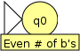
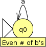
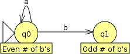
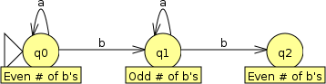
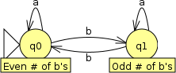
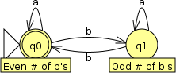
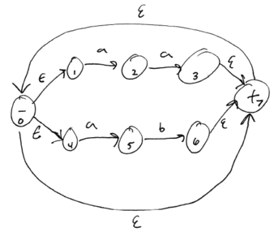
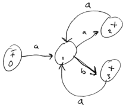

Designing Finite Automata
=========================

The single most important thing to keep in mind when you are creating a finite automaton to recognize a regular language is the following:

> **Each state represents a property describing a prefix of the input string.**

The idea is that when the automaton is in a particular state, we know something specific that must be true of the part of the input string that has been processed by the automaton.

For example, say we want to construct a finite automaton to recognize all strings over the alphabet {a, b} which contain an even number of b's. There is one property that the finite automaton needs to keep track of: whether the number of b's it has seen so far is even or odd. In the start state, we know that the automaton has not seen any symbols, and thus the number of b's it has seen is even:

> 

Now, we need to think of the effect that following a transition and consuming an input symbol will have about the automaton's knowledge of whether there are an even or odd number of b's. A transition on **a** does not affect the number of b's, so the automaton can stay in the same state:

> 

However, a transition on **b** will change the number of b's seen by the automaton from even to odd. We need a new state to represent this possibility. Again, we will label it with the fact about the input string that it represents:

> 

From this new state, we again think about what happens when the automaton follows a transition and consumes an input symbol. Like the first state, an **a** doesn't change the number of b's, and the automaton stays in the same state, while a **b** changes the number of b's seen from odd to even. We could make a new state for this second possibility (even b's):

> 

However, making a new state is unnecessary, since *we already have a state that represents an even number of b's*:

> 

This is an important principle in designing finite automata: an automaton should have exactly one state that represents any particular property about the input string. Reusing states where possible results in a simpler automaton.

To complete our automaton, we need to designate one or more states as final (accepting) states. If processing of an input string ends in the "Even \# of b's" state, then it automaton should accept it, so that state should be marked as a final state. If processing ends in the "Odd \# of b's" state, then the string should be rejected, so that state should not be a final state:

> 

Simulating an NFA
=================

In the last lecture, we discussed that a nondeterministic choice in a finite automaton could be thought of splitting into "parallel universes".

Another way to think of nondeterminism is that the NFA is in *multiple states at the same time*. For example, if a state **q0** has an &epsilon;-transition to another state **q1**, then any time the automaton is in state **q0**, it is also in state **q1**.

Also, if a state **q0** has two transitions on the same input symbol *X*, leading to states **q1** and **q2**, then processing an *X* in state **q0** with cause the automaton to enter *both* states **q1** and **q2**.

[Show an example of an NFA processing a string.]

Converting an NFA to a DFA
==========================

Recall that any nondeterministic finite automaton (NFA) can be converted to an equivalent deterministic finite automaton (DFA).

Here is a sketch of an algorithm to convert an NFA into a DFA. This algorithm uses the same basic idea as simulating the execution of an NFA by keeping track of *sets* of states that the NFA is in. However, instead of using the simulation to process an input string, the simulation is used to convert sets of NFA states into a single equivalent DFA state, for all possible sets of paths through the NFA.

<pre>
table := <i>map sets of NFA states to corresponding DFA state</i>

<i>-- this function converts an NFA to a DFA</i>

function ConvertNFAToDFA() {
	work list := new empty queue

	Start := set of NFA states equivalent to NFA start state

	enqueue Start on to work list

	while (work list is not empty) {
		S := dequeue a set of NFA states from the work list

		if (S has not been processed yet) {
			mark S as processed

			D = MapNFAStatesToDFAState(S)

			for each symbol Y in alphabet {
				T = set of states reachable on Y

				E = MapNFAStatesToDFAState(T)

				create DFA transition from D to E on symbol Y

				enqueue T on to the work list
			}
		}
	}

	mark the first DFA state created as the DFA start state
}

<i>-- this function returns the DFA state correpsonding to a set of NFA states,</i>
<i>-- creating the DFA state if necessary</i>

function MapNFAStatesToDFAStates(U) {
	if (table contains entry for U) {
		return the DFA state in table corresponding to U
	}

	create new DFA state F in table corresponding to U

	if (U contains an NFA accepting state) {
		make F an accepting state
	}

	return F
}
</pre>

Example
-------

Input NFA:

> 

Output DFA:

> 

Table of NFA state sets to DFA states:

> NFA State Set | DFA State
> ------------- | ---------
> {0, 1, 4, 7} | 0
> {2, 5} | 1
> {0, 1, 3, 4, 7} | 2
> {0, 1, 4, 6, 7} | 3
