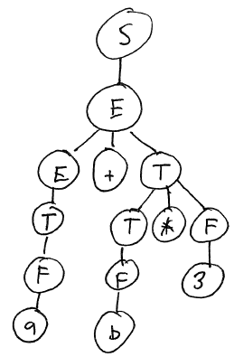

Eliminating Ambiguity
=====================

Ambiguity in a context-free grammar can generally be eliminated by rewriting the grammar. Here is a grammar for the same expression language that yields syntax trees that follow the usual precedence rules for arithmetic:

> S → E
>
> E → T \| E + T \| E - T
>
> T → F \| T \* F \| T / F
>
> F → a \| b \| 0 \| 1 \| 2 \| 3 \| 4 \| 5 \| 6 \| 7 \| 8 \| 9

Note that we now have additional nonterminal symbols:

> E is an "expression" - an expression that may involve addition or subtraction
>
> T is a "term" - an expression that may involve multiplication or division
>
> F is a "factor" - a leaf in the syntax tree (variable or number)

These nonterminals represent increasing *operator precedence*.

The structure of the grammar ensures two important properties

1.  The grammar is unambiguous: any input string will result in a unique syntax tree

2.  The associativity of the operators is left-to-right; this means that the string "8 - 5 + 3" is interpreted as "(8 - 5) + 3", not "8 - (5 + 3)".

Here is the derivation of the input string "a + b \* 3"

> String | Production to apply
> ------ | -------------------
> S | S → E
> E | E → E + T
> E + T | E → T
> T + T | T → F
> F + T | F → a
> a + T | T → T * F
> a + T * F | T → F
> a + F * F | F → b
> a + b * F | F → 3
> a + b * 3 | 

This derivation results in the following syntax tree:

> 

Here is an informal argument why this grammar cannot yield an incorrect syntax tree for "a + b \* 3". If it did, the multiplication would have to occur "higher" in the syntax tree than the addition, meaning that the production introducing the multiplication to the syntax tree would have to occur earlier than the production introducing the addition. There is only one production that introduces multiplication: T → T \* F. However, the nonterminals T and F cannot introduce an addition. So, the addition must be added to the syntax tree earlier than the multiplication.

Parsing
=======

Recall that *parsing* is the problem of taking a string of terminal symbols and finding a derivation for that string of symbols in a context-free grammar. Parsing is critical task in implementing an interpreter or compiler for a programming language, since the syntax of a program contains essential information about the *meaning* of the program.

A *parser* is the module of an interpreter or compiler which performs parsing. It takes a sequence of *tokens* from the lexical analyzer (you know how to write one of those!), finds a derivation for the sequence of tokens, and builds a *parse tree* (also known as a *syntax* tree) representing the derivation. We have seen that parse trees are very important in figuring out the meaning of a program (or part of a program).

Recursive Descent
-----------------

Recursive descent is a simple parsing algorithm that is very easy to implement. It is a *top-down* parsing algorithm because it builds the parse tree from the top (the start symbol) down.

The main limitation of recursive descent parsing (and top-down parsing algorithms in general) is that they only work on grammars with certain properties. For example, if a grammar contains any *left recursion*, recursive descent parsing doesn't work.

Eliminating Left Recursion
--------------------------

Here's our simple expression grammar we discussed earlier:

> S → E
>
> E → T \| E + T \| E - T
>
> T → F \| T \* F \| T / F
>
> F → a \| b \| 0 \| 1 \| 2 \| 3 \| 4 \| 5 \| 6 \| 7 \| 8 \| 9

[S, E, T, and F are nonterminal symbols, and **a**, **b**, and the digits 0-9 are terminal symbols.]

Unfortunately, this grammar is not suitable for parsing by recursive descent, because it uses left recursion. For example, consider the production

> E → E + T

This production is left recursive because the nonterminal on the left hand side of the production, **E**, is the first symbol on the right hand side of the production.

To adapt this grammar to use with a recursive descent parser, we need to eliminate the left recursion. There is a simple technique for eliminating immediate instances of left recursion. [This technique won't handle indirect instances of left recursion.]

Given an occurrence of left-recursion:

> A → A α
>
> A → β

Note that some non-recursive production of the form A → β must exist; otherwise, we could never eliminate occurrences of the nonterminal A from our working string when constructing a derivation.

We can rewrite the rules to eliminate the left recursion as follows:

> A → β A'
>
> A' → α A'
>
> A' → &epsilon;

So, for example,

> E → E + T
>
> E → T

becomes

> E → T E'
>
> E' → + T E'
>
> E' → &epsilon;

Here's the entire expression grammar, with left-recursion eliminated.

> S → E
>
> E → T E'
>
> E' → + T E'
>
> E' → - T E'
>
> E' → &epsilon;
>
> T → F T'
>
> T' → \* F T'
>
> T' → / F T'
>
> T' → &epsilon;
>
> F → a \| b \| 0 \| 1 \| 2 \| ... \| 9

Left-Factoring
--------------

Another property required of a grammar to be suitable for top-down parsing is that the grammar is *left-factored*. A left-factored grammar is one where for each nonterminal, there are no two productions on that nonterminal which have a common nonempty prefix of symbols on the right-hand side of the production.

For example, here is a grammar that is not left-factored:

> A → a b c
>
> A → a b d

Both productions share the common prefix **a b** on the right hand side of the production.

We can left-factor the grammar by making a new nonterminal to represent the alternatives for the symbols following the common prefix:

> A → a b A'
>
> A' → c
>
> A' → d

Our non-left-recursive expression grammar is already left-factored, so we don't need to change it.

Note that left-factoring isn't always necessary.  If the common prefix of two or more productions consists of only terminal symbols, then the parser can use the lexical analyzer to look ahead by more than one terminal symbol, and wait until a distinguishing terminal symbol is seen to decide which production to apply.

Recursive Descent Parsing
-------------------------

Once you have a non-left-recursive, left-factored grammar, recursive descent parsing is (generally) easy to implement.

Each nonterminal symbol has a *parse function*. The purpose of the parse function for a nonterminal symbol is to choose and apply one of the productions having that nonterminal symbol on the left hand side. The parse function must ensure that the production chosen will lead to a valid derivation for the input string (if one exists).

A parse function will choose a production to apply by using the lexical analyzer to "peek" ahead in the input stream. The next terminal symbol seen (or the end of the input stream) should allow the parse function to determine which production to apply.

Once the parse function chooses a production, it applies the production by iterating through the symbols on the right hand side of the production. Each terminal symbol is handled by consuming a token using the lexical analyzer. Each nonterminal symbol is handled by calling the parse function for that nonterminal.

Typically, a parser will construct a parse tree as a side-effect of parsing a string of input symbols. The nodes of a parse tree represent the nonterminal and nonterminal symbols generated in the derivation of the input string. So, we can have the parse method for each nonterminal return a reference to a parse tree node for that particular nonterminal symbol.

### Example

Here's what a parse method for the **E** nonterminal in our revised expression grammar might look like (in Ruby):

    def parseE
        # E -> T E'
        n = Node::nonterminal(:E)
        n.add_child(parseT())
        n.add_child(parseEPrime())
        return n
    end

The **parseE** method internally calls **parseT** and **parseEPrime** methods, because the only production on **E** is

> E → T E'

The **parseT** method is similar.

The **parseEPrime** method is more interesting. There are three productions on **E'**:

> E' → &epsilon;
>
> E' → + T E'
>
> E' → - T E'

When **parseEPrime** is called, we should ask the lexical analyzer if we've reached the end of the input string. If so, then the epsilon production must be applied.

If the lexer is not at end-of-input, we should ask the lexical analyzer for a single terminal symbol. If we see a symbol other than **+** or **-**, then we'll again assume that the epsilon production should be applied. Otherwise, we'll add the terminal symbol to the parse node we're creating for the **E'** symbol, and continue by parsing the **T** and **E'** nonterminal symbols by calling their parse methods:

    def parseEPrime
        n = Node::nonterminal(:EPrime)
        t = @lexer.peek()
        if !t.nil? && (t.get_type() == :op_plus || t.get_type() == :op_minus)
            # E' -> + T E'
            # E' -> - T E'
            t = @lexer.next()
            n.add_child(Node::terminal(t))
            n.add_child(parseT())
            n.add_child(parseEPrime())
        else
            # E' -> epsilon
        end

        return n
    end

Note a few interesting things going on in **parseEPrime**:

-   The lexical analyzer is the **@lexer** object. We're using two of its methods: **peek**, which asks for the next token without consuming it, and **next**, which asks for and consumes the next token. Both methods return a **Token** object. **peek** returns the **nil** value when the end of input is reached.
-   Applying the epsilon production means we don't add any child symbols to the parse node being created.
-   The **parseEPrime** method can call itself recursively, because the

    > E' → + T E'
    >
    > E' → - T E'

    productions contain the symbol **E'** on the right hand side. That's why it's called recursive descent!

To use a recursive descent parser to parse an entire input string, simply call the parse method for the grammar's start symbol. It will return a reference to the root node of the parse tree.

Complete Example
----------------

If you download [the example](recursiveDescent.zip) and unzip it, you can run the **Parser.rb** program, which will read an infix expression from the standard input. (To tell the parser that you are done typing the expression, type control-D at the beginning of a blank line.)

For example, if you type the input

    a + b * 3

then the output of the program will be

    S
    +--E
       +--T
       |  +--F
       |  |  +--var("a")
       |  +--TPrime
       |     +--op_mul("*")
       |     +--F
       |     |  +--var("b")
       |     +--TPrime
       |        +--op_mul("*")
       |        +--F
       |        |  +--num("3")
       |        +--TPrime
       +--EPrime

This is a textual representation of the parse tree created by the parser.

Note: Here is a Java version of the parser: [RecursiveDescentJava.zip](RecursiveDescentJava.zip).
