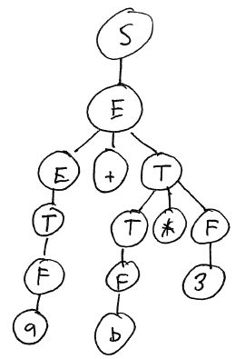

Problems With Recursive Descent
===============================

Parsing infix expression grammars with recursive descent is somewhat awkward. There are two general problems:

1.  Each precedence level requires a separate nonterminal, leading to lots of productions and long chains of "useless" nonterminal nodes in the parse tree
2.  Left factoring and eliminating left recursion results in complicated grammars

Let's consider each of these problems.

Representing Precedence Levels with Nonterminals
------------------------------------------------

For a language with only a small number of operator precedence levels, using a separate nonterminal for each precedence level isn't too bad. For example, our example expression grammar has three precedence levels: **F**actors (literals and variables), **T**erms (multiplication and division), and **E**xpressions (addition and subtraction).

However, many programming languages have a fairly large number of precedence levels. For example, Java has 15 precedence levels. This leads to a complicated grammar.

Another problem with using nonterminals to represent precedence levels is that they can create long chains of useless nonterminal nodes in the parse tree. For example, consider an expression consisting of a single integer literal. Using the final version of our expression grammar (left-factored and with left recursion eliminated), a derivation for this expression and the resulting parse tree would look like this:

> String | Production to apply
> ------ | -------------------
> S | S → E
> E | E → T E'
> T E' | T → F T'
> F T' E' | F → 3
> 3 T' E' | T' → &epsilon;
> 3 E' | E' → &epsilon;

> 

It is important to be clear that there is nothing *incorrect* about this parse tree. It's just more complicated than we would like.

Abstract Syntax Trees can help reduce the complexity of the tree by eliminating redundant nodes. However, requiring one nonterminal symbol for each precedence level still makes our grammar and parser more complicated than we would like.

Complexity Introduced by Left Factoring and Eliminating Left Recursion
----------------------------------------------------------------------

The transformations we made to left factor our expression grammar and eliminate left recursion resulted in an "ugly" grammar.

Consider the derivations and parse trees for the string a + b \* 3 in the original grammar and the modified grammar.

Here is the derivation and parse tree for the original grammar:

> String | Production to apply
> ------ | -------------------
> S | S → E
> E | E → E + T
> E + T | E → T
> T + T | T → F
> F + T | F → a
> a + T | T → T * F
> a + T * F | T → F
> a + F * F | F → b
> a + b * F | F → 3
> a + b * 3 | 

> 

Here is the derivation and parse tree for the transformed grammar (where left recursion is eliminated):

> String | Production to apply
> ------ | -------------------
> S | S → E
> E | E → T E'
> T E' | T → F T'
> F T' E' | F → a
> a T' E' | T' → &epsilon;
> a E' | E' → + T E'
> a + T E' | T → F T'
> a + F T' E' | F → b
> a + b T' E' | T' → * F T'
> a + b * F T' E' | F → 3
> a + b * 3 T' E' | T' → &epsilon;
> a + b * 3 E' | E' → &epsilon;

> 

The main problem with the parse tree produced by the transformed grammar is that the operator, which was previously a child of the parent node which joined the subtrees representing the left and right hand operands of the operator, is now attached to the subtree containing the right operand. This makes it somewhat more challenging to interpret the meaning of the parse tree.

Abstract Syntax Trees
---------------------

We use a language's grammar for two related, but distinct, purposes:

1.  To determine which input strings belong to the language
2.  To determine a meaning for input strings that are part of the language

As we saw with the expression grammar, the meaning of a string is determined by the structure of its parse tree.

A complex grammar leads to complex parse trees. An *abstract syntax tree*, or AST, is a simplification of a parse tree which eliminates all unnecessary nodes. Typically, in an AST, each node in the tree represents an operation to be performed. The leaves of an AST typically represent "primary" constructs such as literals and variable references: these nodes have a meaning that does not depend on child nodes.

For example, let's compare the parse tree for **a + b \* 3** with a possible representation as an abstract syntax tree:

Notice how much simpler the abstract syntax tree is.

Because ASTs are simpler than parse trees, most programming language implementations (interpreters and compilers) use ASTs as the representation of a program's source code.

Precedence Climbing
===================

[Precedence climbing](http://en.wikipedia.org/wiki/Operator-precedence_parser) is a parsing algorithm designed specifically for parsing infix expressions.

The idea behind precedence climbing is that an infix expression is a sequence of *primary expressions* separated by operators. A primary expression is one at the highest precedence level: typically, a literal value, variable, or an explicitly-parenthesized expression.

Here is the pseudo-code (from the [Wikipedia article](http://en.wikipedia.org/wiki/Operator-precedence_parser)):

The idea is that a call to *parse\_expression\_1* will attempt to build an expression by consuming operators (and their operands) from the input string for all operators whose precedence is at least as high as the current "minimum" precedence level. Each time a higher-precedence operator is encountered, or a right-associative operator at the same precedence level is encountered, a recursive call is made to parse the subexpression.

Implementation
--------------

You can download [an implementation](precedenceClimbing.zip) of the precedence climbing algorithm, which is a modified version of the [recursive descent](recursiveDescent.zip) parser.  (Also: [Java implementation](PrecedenceClimbingJava.zip).)

The **parse** method in the **Parser** class implements the algorithm:

    def parse
        return _parse_1(_parse_primary(), 0)
    end

    def _parse_1(lhs, min_prec)
        # while the next token is a binary operator whose precedence is >= min_precedence
        while true
            op = @lexer.peek()
            break if op.nil? or !_is_operator(op) or _prec(op) < min_prec
            @lexer.next()
            rhs = _parse_primary()

            # while the next token is
            #   (1) a binary operator whose precedence is greater than op's, or
            #   (2) a right-associative operator whose precedence is equal to op's
            while true
                lookahead = @lexer.peek()
                break if (lookahead.nil? or
                    !_is_operator(lookahead) or
                    !(_prec(lookahead) > _prec(op) or
                      (_assoc(lookahead) == :right and _prec(lookahead) == _prec(op))))
                rhs = _parse_1(rhs, _prec(lookahead))
            end

            n = Node::nonterminal(op.get_type())
            n.add_child(lhs)
            n.add_child(rhs)
            lhs = n
        end

        return lhs
    end

This is a straightforward translation of the pseudo-code into Ruby.

The **\_prec** and **\_assoc** methods specify the precedence and associativity of operators. For example, here is the **\_prec** method:

    def _prec(op)
        case op.get_type()
        when :op_plus, :op_minus
            return 0
        when :op_mul, :op_div
            return 1
        end
    end

This is one of the main strengths of precedence climbing: new operators and precedence levels can be added by modifying this method.

Another advantage of precedence climbing is that it produces very simple parse trees. Each operator is represented by a nonterminal node labeled with the operator. Each operator node has two children which represent the operands. For example, the expression

    a + b * 3

produces the tree

    op_plus
    +--primary
    |  +--var("a")
    +--op_mul
       +--primary
       |  +--var("b")
       +--primary
          +--num("3")

Note how much simpler this is than the tree produced by recursive descent! In fact, this tree is essentially an abstract syntax tree: there is no redundant information at all.
