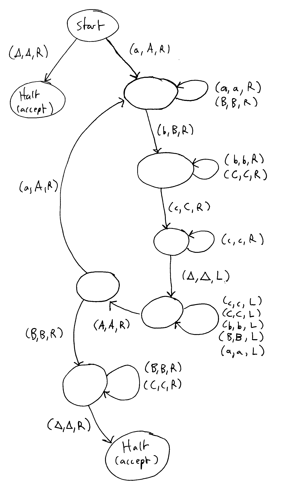

# Turing Machines

A Turing machine (TM) is the most powerful kind of automaton that we will discuss.  In fact, Turing machines are capable of solving any problem that can be solved by computation.  (There are some problems that are not solvable by a computation, as we will see shortly.)

Turing machines are named after [Alan Turing](http://en.wikipedia.org/wiki/Alan_turing), the mathematician who invented them.

Turning machines are similar to PDAs: they consist of states and transitions, and use an infinite tape for storage.  Unlike PDAs, however, the use of the tape by a Turing machine is not limited to pushing and popping symbols: it can move the tape either left or right after writing a symbol on the tape.  Unlike a PDA, the tape is used as BOTH the input string and the temporary storage.  In addition, when the Turing machine terminates we can consider the contents of the tape to be output.  In this way, a Turing machine is more than a recognizer for strings in a language.

A Turing machine, like a PDA, has a "tape head" indicating the current location on the tape that the Turing machine is looking at.  The symbol underneath the tape head is used to determine which transition will be followed.

Each transition in the state diagram of a Turing machine is labeled with three symbols

> (i, o, d)

"i" is an input symbol.  The transition will be taken if the symbol underneath the tape head matches this symbol.

"o" is an output symbol.  If the transition is taken, then this symbol is written to the location underneath the tape head, overwriting whatever symbol was there previously.

"d" is a direction: L (left) or R (right).  If the transition is taken the tape head is moved one position in the specified direction.

The Turing machine completes its computation if it reaches a state labeled "Halt".

## Turing machine that can recognize the language anbncn

Here is a description of a Turing machinen that can recognize the language  anbncn, which we have noted is not a context-free language.

The Turing machine will operate by scanning from left to right, replacing one set of a,b,c symbols with upper case symbols A,B,C.  When it reaches the Δ symbol marking the end of the string, it will "rewind" from right to left to work on the next set of a,b,c symbols.  If no more a symbols remain in the string, it will scan from left to right to verify that no more b or c symbols remain.  If the verification succeeds (no b or c symbols are encountered), then the original string has been accepted as a member of the language.

Example: we will start out with a tape that looks like this, representing the string "aabbcc".  (The tape head is positioned at the underlined symbol.)

> aabbccΔ
> 
> Here is how the TM progresses:
> 
> AabbccΔ
> 
> AabbccΔ
> 
> AaBbccΔ
> 
> AaBbccΔ
> 
> AaBbCcΔ
> 
> AaBbCcΔ
> 
> ("rewind" by moving left until the Turing machine encounters an A symbol)
> 
> AaBbCcΔ    (move right)
> 
> AaBbCcΔ    (replace one more a,b,c set with A,B,C)
> 
> AABbCcΔ
> 
> AABbCcΔ
> 
> AABBCcΔ
> 
> AABBCcΔ
> 
> AABBCCΔ
> 
> ("rewind" by moving left until the Turing machine encounters an A symbol)
> 
> AABBCCΔ    (move right)
> 
> AABBCCΔ    (because a B was encountered, there are no more a symbols, so we verify that no b or c symbols remain)
> 
> AABBCCΔ
> 
> AABBCCΔ
> 
> AABBCCΔ
> 
> AABBCCΔ    (Halt)

If at any step in the process the Turing machine encounters an unexpected symbol, then it does not halt (and is considered to have rejected the original input string.)

Here is a state diagram of this Turing Machine:

This turing machine as a JFLAP file: [anbncn.jff](anbncn.jff)

## Turing Completeness

It may seem surprising, but Turing machines have been shown to be at least as powerful as every "reasonable" known model of computation.  For example, if we wanted to we could translate a C++ or Java program into a Turing machine.

Any model of computation that can be translated into an equivalent Turing machine is said to be Turing complete.
