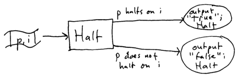
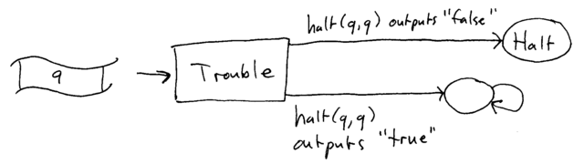

# Decidability

The problem of decidability may be stated roughly as follows: is it possible for an algorithm to correctly answer a yes/no question for all possible input?

For example:

> Is there an algorithm that will tell us whether or not two arbitrary DFAs recognize the same language?
>
> Is there an algorithm that will tell us whether or not two arbitrary context-free grammars generate the same language?
>
> Given an arbitrary Turing machine and initial tape, will the Turing machine reach the Halt state?

A problem is decidable if such an algorithm exsits. The first problem (deciding whether or not two DFAs are equivalent) is decidable. The second two problems are undecidable: there is no algorithm that can correctly answer these questions for all possible input. The last problem (whether or not a Turing machine will reach the Halt state for some initial tape) is known as the Halting Problem, and is a very famous problem in the theory of computation.

Universal Turing Machine
========================

Recall that a Turing Machine is capable of performing any computation. One possible computation a Turing Machine could perform is *simulating* the behavior of another Turing Machine with a given string of symbols as its input tape. The idea is that the Turing Machine to be simulated is encoded as a string of symbols (representing its states and transitions). The encoded Turing Machine is then joined with a string of symbols to serve as its input, and the entire string becomes the input to the Universal Turing Machine.

If you think of a Turing Machine as "hardware", then you can think of an encoded Turing Machine as "software" that executes on the hardware of the Universal Turing Machine. This is analagous to executing a programming language interpreter on a CPU.

The proof of the undecidability of the Halting Problem uses the notion of encoding a Turing Machine as a string of symbols.

The Halting Problem is Undecidable
==================================

Here is a sketch of how you can prove that the Halting problem is undecidable. (This is a summary of the proof presented in the [Wikipedia article on the Halting Problem](http://en.wikipedia.org/wiki/Halting_problem): see the section entitiled "Sketch of proof".)

Assume that a TM capable of solving the halting problem exists. Call this TM **halt**. It takes, as input, the encoded representation of a TM and an input tape on which the encoded TM will run. Let's call this input pair (**p**,**i**): **p** for "program" (the encoded TM) and **i** for "input" (the input tape). If input TM **p** will halt on input **i**, then **halt** halts and outputs "true". If input TM **p** will not halt on **i**, then **halt** halts and outputs "false". So, we can view **halt** as a function that takes parameters **p** and **i** and produces the output "true" or "false" depending on whether or not TM **p** halts on input **i**.

> 

Based on **halt**, we can trivially construct a new TM, which we can call **trouble**, which will work as follows. It first duplicates the entire input tape **q**, creating two copies of the original input tape. It then runs **halt**, using one copy of the original input **q** as parameter **p** and the other copy of the original input **q** as parameter **i**. If **halt(q,q)** outputs "false", then trouble TM halts. If **halt(q,q)** outputs "true", then **trouble** goes into an infinite loop (and thus does not halt).

> 

Any TM can be encoded as an initial tape. So, let's assume that the encoding of trouble as a tape is called **t**.

Consider what will happen when trouble is executed with **t** as its input tape. Does trouble halt?

> If trouble halts, that means that **halt(t,t)** answered "false". However, that means that **trouble** does not halt when given **t** as input.
>
> If trouble does not halt, that means that **halt(t,t)** answered "true". However, that means that **trouble** does halt when given **t** as input.

In either case, **halt** gave the wrong answer. Therefore, given any TM that claims to solve the halting problem, it is possible to construct an program/input pair for which it will answer incorrectly. So, any claim that a particular TM solves the Halting problem can be proved false, meaning that the Halting Problem is undecidable.

The undecidability of the halting problem has several important consequences. The main consequence is that, in general, it is impossible to predict exactly what a program will do when it is executed. This problem may be stated as follows:

> Nontriivial properties of programs are undecidable.
