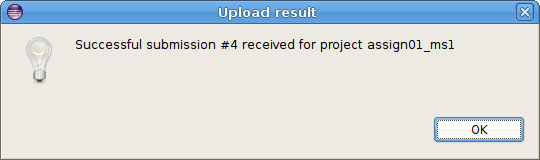

This page has links to some useful resources for the course.

# JFLAP

Create and test finite automata and Turing Machines.

* Download: [JFLAP.jar](JFLAP.jar)
* Website: <http://jflap.org>

# RegexToolkit

Test regular expressions by checking strings and determing whether two regular expresisons are equivalent.

* Download: [regexToolkit.jar](regexToolkit.jar)
* Website: <https://github.com/daveho/RegexToolkit>

RegexToolkit is a slightly improved version of **regexChecker.jar** and **regexEquivalenceChecker.jar** from [Lab 1](../labs/lab01.html).

Run it as follows:

* To test whether strings are accepted or rejected by a regular expression, run the command

      java -jar regexToolkit.jar check

* To test whether two regular expressions are equivalent, run the command

      java -jar regexToolkit.jar equiv

# Clojure resources

* [ClojureDocs.org](http://www.clojuredocs.org/) has documentation and examples for the built-in Clojure functions

# SimpleMarmosetUploader plugin

You can install the SimpleMarmosetUploader plugin to allow you to submit Java and Clojure projects directly from Eclipse.

The plugin requires Eclipse 3.4 (ganymede) or later.

Please be aware that the plugin is somewhat experimental. [Let me know](mailto:dhovemey@ycp.edu) if you encounter any problems using it.

Installing the plugin
---------------------

Choose **Help** → **Install New Software...**.

Click the **Add...** button

In the **Location:** field, paste the following URL:

> http://faculty.ycp.edu/~dhovemey/simpleMarmosetUploader

In the **Name:** field, enter **Simple Marmoset Uploader**.

Click **OK**. In the **Install** dialog, click on **SimpleMarmosetUploaderFeature**. Both checkboxes should be checked now.

The dialog should now look something like this (click for full size):

> 

Click **Next** twice. When prompted, accept the license agreement, then click **Finish**.

When you see the warning about software that contains unsigned content, click **OK**.

When prompted, click **Restart Now** to restart Eclipse. The plugin should now be available.

Using the plugin
----------------

When you are ready to submit a project (lab or assignment), there are two ways.

1.  Select the project in the package explorer and then press the blue up arrow button in the toolbar:

    > 

2.  Right click on the project and choose **Submit project...**.

If the project has been enabled for submission within Eclipse, you will see a dialog that looks something like the following:

> 

Note: if the project has multiple milestones, the dialog might look like this:

> 

If there are multiple inboxes, you will need to select one.

Enter your Marmoset username and password and click **OK**. If the submission is successful, you will see a dialog that looks something like this:

> 

**Important**: you should still log into the submission server using a web browser to verify that your files were received successfully.
